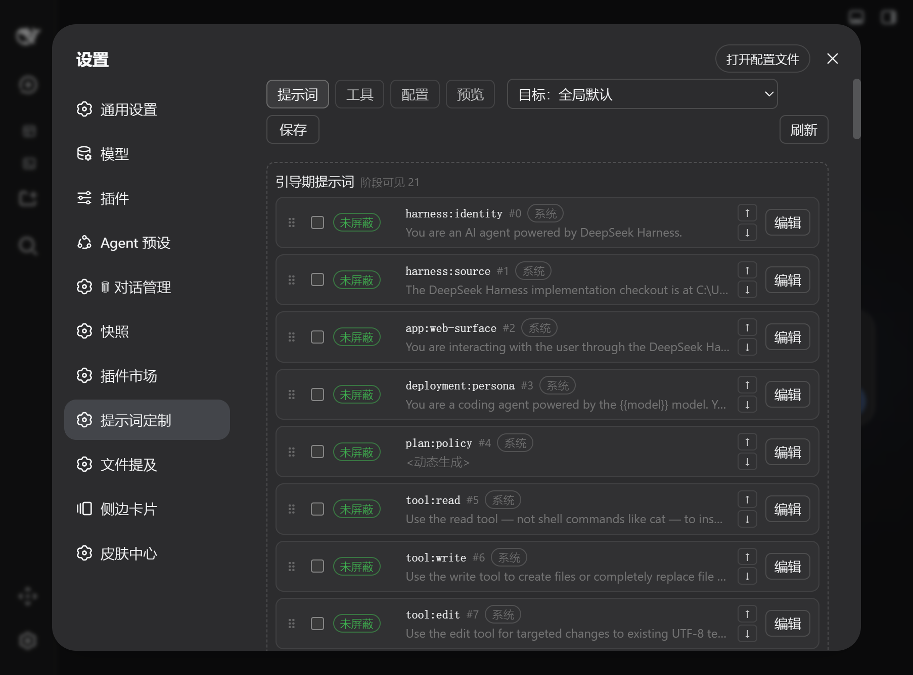
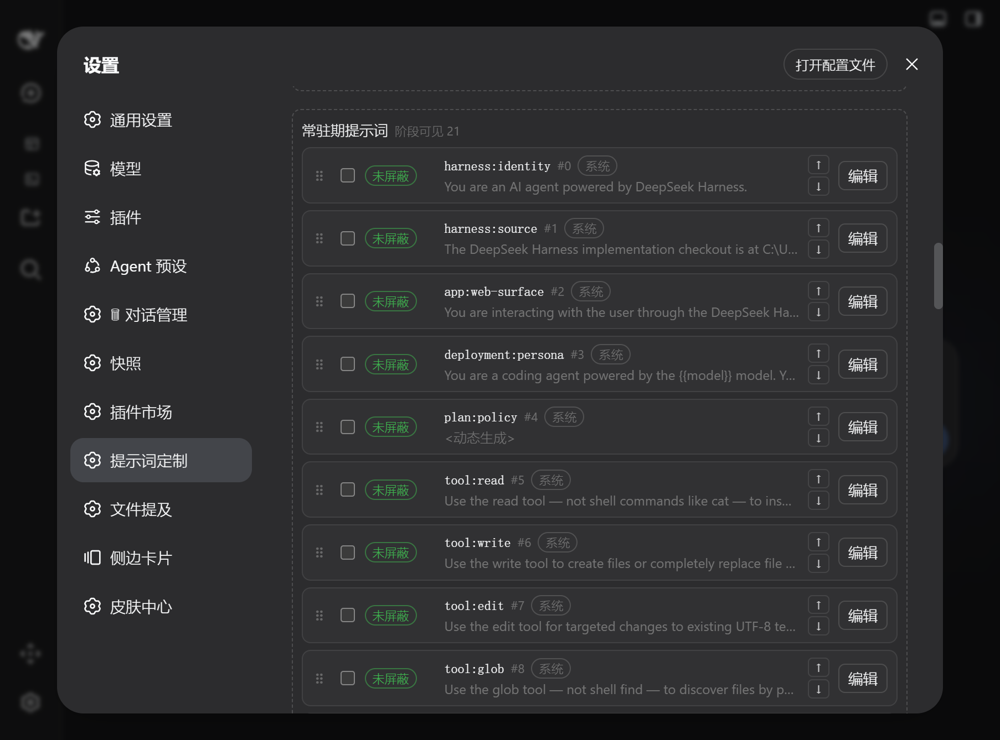
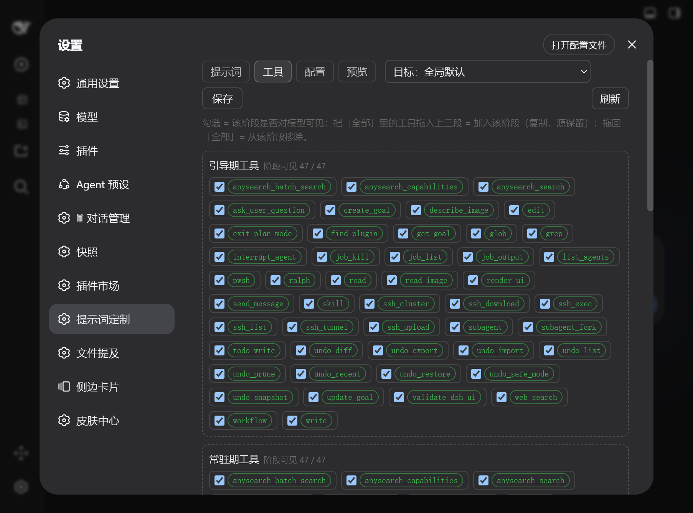
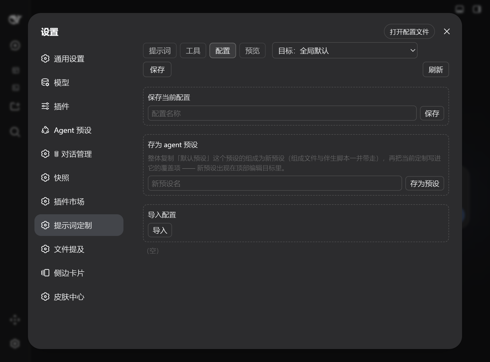
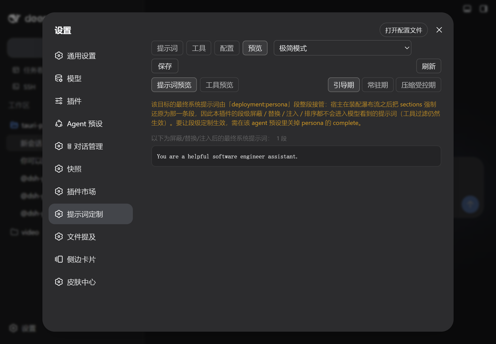

# dsh-prompt-customizer

> **English** | [简体中文](README.md)

A [DeepSeek Harness](https://github.com/deepseek-ai/deepseek-harness) (dsh) plugin that lets you control the **system prompt** and the **tool catalog** from a settings-panel UI.

Plugin-injected prompt sections can pollute your system prompt. This plugin lets you **block**, **replace**, **inject** and **reorder** prompt sections by name, and **hide tools** from the model-facing catalog — live, without touching any other plugin.

Two ideas run through the whole design:

- **Per session phase.** Bootstrap (before promotion) / resident (after promotion) / compaction-controlled (after a compaction, before re-promotion) each get their **own block list, their own ordering space and their own tool catalog**. One preset can therefore show the model 1 tool and a handful of sections on the first turn, then open everything up after promotion.
- **Per agent preset.** The selector at the top chooses where edits land: `Target: global default` edits the defaults; picking an agent preset writes a field-level override for that preset only (set fields take over, unset fields keep falling back to global).

## How the session phases flow

The phases are not a fixed three-beat rhythm — they are **derived from durable session
events**: the first durable `tool/call` or `assistant/message` promotes, and a
`compaction/end` resets that promotion. The three parts of the panel map to those states.

<table>
  <tr align="center">
    <td width="28%"><b>① Session starts</b><br><code>bootstrap</code><br><b>Guide period</b></td>
    <td width="6%">→</td>
    <td width="28%"><b>② First durable signal</b><br><code>tool/call</code> · <code>assistant/message</code><br><b>Resident period</b> <code>active</code></td>
    <td width="6%">→</td>
    <td width="32%"><b>③ A compaction</b><br><code>compaction/end</code><br><b>Compaction-controlled</b> <code>compaction</code></td>
  </tr>
  <tr>
    <td colspan="5" align="center">
      ④ another durable signal after the compaction → <b>back to the resident period</b>; compact again and it falls back to compaction-controlled
    </td>
  </tr>
</table>

Every transition (note the guide period can reach compaction-controlled without passing through resident):

| Current phase | Event | Next |
| --- | --- | --- |
| Guide | first durable `tool/call` / `assistant/message` | **Resident** |
| Guide | `compaction/end` | **Compaction-controlled** |
| Resident | `compaction/end` (promotion reset) | **Compaction-controlled** |
| Compaction-controlled | a new durable signal after the compaction | **Resident** |
| Any | subagent session (`delegationDepth > 0`) | always **Resident** |
| Any | read with no session (inventory, preview) | always **Resident** |

What each phase resolves to — the three panel parts map one-to-one onto config fields:

| Panel part | Effective section blocks | Injected `phase` | Effective tool blacklist |
| --- | --- | --- | --- |
| Guide-period sections / tools | `sections` ∪ `sectionsBootstrap` | `bootstrap` (+ `always`) | `tools.bootstrap.exclude`, falling back to static when unset |
| Resident-period sections / tools | `sections` | `active` (+ `always`) | `tools.exclude` (static) |
| Compaction-controlled sections / tools | `sections` ∪ `sectionsCompaction` | `compaction` (+ `always`) | `tools.compaction.exclude`, falling back to bootstrap, then static |

Two things that bite:

- **`always` injections are present in all three phases**, and each phase has its own ordering space — which is why this plugin emits phase entries *after* the `always` group: the assembly applies inject records in array order and the last write wins, so the phase order is what survives.
- **A phase view is "what this state resolves to", not "what the session has been".** Native preset phase rules (zero-tool bootstrap, warmup, …) are in play at the same moment and may still change the result after other plugins — see [Known limitations](#known-limitations).

## UI











## Features

### Prompt sections

- **Block** — remove a section by name. A blocked row does not disappear: it stays draggable and editable and can be restored at any time. Blocking only means "not injected into the model".
- **Replace** — edit a section's text; the editor is pre-filled with the text currently in effect (dynamically generated sections are resolved first so you see real content).
- **Inject** — every phase part has its own name + text box to add a brand-new section, badged `manual` and deletable.
- **Reorder** — drag a whole row (an insert line appears above/below the target row) or use ↑/↓. Order is stored as a contiguous 0-based virtual index, so there are never duplicate or fractional orders and no number to type by hand.
- **Independent per phase** — bootstrap blocks go to `sectionsBootstrap`, compaction blocks to `sectionsCompaction`, resident blocks to `sections`; each phase has its own ordering space, so "5 sections during bootstrap, everything when resident" is expressible.

### Tool catalog

- **Blacklist only** (`exclude`) — unchecking a tool hides it **in that phase**; checking it back restores it. There is no whitelist mode: it silenced `exclude` entirely, and a single drag could quietly switch off every other tool in the phase while offering no expressive gain.
- **Dragging in = make that one tool visible in the phase** (remove it from the phase blacklist); dragging back to *All system tools* hides it there. Every action touches only the tool you dragged.
- **Phase catalogs** — bootstrap and compaction each have their own blacklist. Runtime precedence is **compaction > bootstrap > static**: after a compaction with a compaction catalog configured, it applies; otherwise an un-promoted session uses the bootstrap catalog; everything else uses the static filter.
- **Narrowing only, never widening** — the filter operates on the catalog the assembly already produced. A tool a phase never had cannot be made to appear here; that means editing the preset's composition.
- Only the model-facing catalog is affected; the tools themselves and routing keep working.

### Model-view preview

The Preview tab shows the final system prompt and tool catalog after **all** plugins have filtered, switchable per phase. It reads the same assembly as the prompt and tools tabs, so what you see is what the model sees. The tools view reports "visible to the model / registry total" side by side — presets such as PTC or Code Mode wrap the whole catalog into a single `run_code`, so the registry alone misleads.

### Config snapshots and agent presets

- **Save current config** — capture the complete customization of the current scope (per-phase block lists, per-phase ordering and phase tool catalogs) as a reusable snapshot.
- **Apply** — same-name sections are overridden, snapshot-only sections are added, and current sections outside the snapshot list are blocked. Phase fields the snapshot does not carry keep your current values instead of being wiped. Only one snapshot is active at a time.
- **Export / import** — snapshots round-trip as JSON (native save/open dialogs under Tauri, download / file picker on web); same-name presets are skipped. Order is stored relatively (each section records which section it follows), so snapshots stay portable across different section sets.
- **Save as agent preset** — **copy** the whole preset directory of the current edit target (composition file, companion scripts, skill directories) into the user preset root, then write the current customization into its override. The new preset immediately appears in the target selector: a real switchable agent preset, not merely a config copy.

### Cross-preset registry pool

*All system sections* / *All system tools* do not follow the edit target: they are a **union across presets that only ever grows** (same name — last seen wins; new name — appended), filled in as you browse presets and stored in the derived cache `catalog.yaml`, which rebuilds itself if deleted.

## How it works

The full path a change takes from the panel to the model:

<table>
  <tr align="center">
    <td width="19%"><b>① Settings panel</b><br>sections / tools / config / preview<br><i>edits an in-memory draft only</i></td>
    <td width="3%">→</td>
    <td width="19%"><b>② Plugin routes</b><br><code>/config</code> · <code>/config/apply</code><br><code>/preview</code> · <code>/inventory</code> · <code>/presets</code></td>
    <td width="3%">→</td>
    <td width="19%"><b>③ config.yaml</b><br>global fields + <code>overrides[preset]</code><br><i>mtime-lazy reload, hand edits apply at once</i></td>
    <td width="3%">→</td>
    <td width="34%"><b>④ Assembly waterfall</b><br>the <code>system-prompt/assemble</code> hook derives the phase from the session, resolves the effective config and filters</td>
  </tr>
  <tr>
    <td colspan="9" align="center"><b>inside ④, in order</b>: <code>mergeConfig(global, overrides[session preset])</code> → sections: block → replace → inject → sort by <code>order</code>; tools: <code>pickToolsFilter</code> (compaction &gt; bootstrap &gt; static) → <code>applyToolFilter</code></td>
  </tr>
  <tr>
    <td colspan="9" align="center">
      <b>⑤ one last move before handing in</b>: after the waterfall the host restores the single <code>complete: true</code> section as the whole <code>sections</code> array when one exists — exactly why the panel shows a yellow warning for such presets (the tool catalog is unaffected)
    </td>
  </tr>
  <tr>
    <td colspan="9" align="center"><b>⑥ the model receives</b>: the final system prompt + visible tool catalog; the Preview tab reads this very result</td>
  </tr>
</table>

Code map:

| Path | Role |
| --- | --- |
| `lib/index.js` | host half: assembly hook, five HTTP routes, agent-preset fork, one-off legacy cleanup |
| `lib/effective.js` | pure functions: field-level override merge, phase selection (injections / tool catalogs), blacklist filtering |
| `lib/promotion.js` | derives `{promoted, boundary}` from durable events — compaction resets, subagents always promoted |
| `lib/sectionOps.mjs` | phase-state pure functions **shared by the panel and the unit tests** (which list to write, injection identity, reorder, per-phase persistence) |
| `lib/store.js` / `lib/catalog.js` | atomic write + last-good fallback config store; cross-preset section/tool accumulation cache |
| `src/client/` | the panel (React written with `h()`, no JSX sugar), bundled into `client/client.js` |

The key convention: phase logic exists once. `lib/sectionOps.mjs` is both bundled into the
browser by tsdown and imported directly by `node --test`, so there is no second
implementation standing between "tests pass" and "the UI behaves".

## Installation

```bash
dsh plugin --profile web add dsh-prompt-customizer
```

Or from a local checkout:

```bash
dsh plugin --profile web add /path/to/dsh-prompt-customizer
```

Then open the dsh web UI → **Settings** → **提示词定制** (Prompt Customizer) in the sidebar.

## Usage

### Prompt tab

The three phase parts (bootstrap / resident / compaction-controlled) are **always rendered** — if a preset has no such phase, that part is simply empty rather than hidden. Each row offers:

- a **checkbox** to block / unblock (`未屏蔽` / `已屏蔽` badge)
- **Edit** to replace the section text; replaced rows carry an `已替换` badge and a restore button
- **↑/↓** and a **drag handle** to reorder within the phase; `#N` is the current virtual index
- a `system` / `manual` badge for provenance — only `manual` sections can be deleted

`阶段可见 N` next to each title is the number of rows in that part. The name + text box at the bottom injects into that part, with the phase already fixed.

### Tools tab

One part per phase, chip-listing the catalog entering that phase's filter, titled `阶段可见 enabled / total`. Check to keep a tool visible in that phase, uncheck to hide it; dragging a tool in from *All system tools* only makes **that one tool** visible in the phase, and dragging it back hides it there. For what the model actually receives, use the tools view in the Preview tab.

### Config tab

Three cards: **Save current config** (snapshot), **Save as agent preset** (fork the current target's preset directory), **Import config**. Each snapshot row is Apply / Export / Delete, and the active row carries an "in use" badge.

### Edit target and saving

The selector at the top decides where changes land. The prompt and tools tabs share one unsaved draft, and **Save** writes it in a single request; switching to the config / preview tabs or changing the edit target discards the draft (after confirming). Nothing you mistype reaches the file until you press Save.

## Where the config lives

- `~/.dsh/prompt-customizer/config.yaml` — the single source of truth. On first start, if this file is missing but the legacy `settings.yaml` has the section, it is migrated once (the master document is left intact and stays rollback-able). Hand edits take effect on the next read, no restart needed.
- `~/.dsh/prompt-customizer/catalog.yaml` — the cross-preset accumulation cache for the pools above. Purely derived; delete it and it rebuilds as you browse.

## Known limitations

All of the below are measured, and the panel shows a yellow warning in exactly these situations rather than leaving you to guess:

- **Some presets have no section-composed prompt.** If a section is registered with `complete: true` (dsh-persona's wholesale takeover), the host restores that single section as the entire `sections` array **after** the assembly waterfall — so this plugin's blocking / replacement / injection / ordering never reaches the model (tool filtering still applies). The panel says so explicitly ("taken over wholesale by `deployment:persona`"). The only way to make section customization work is to turn off `complete` in that agent preset.
- **Dropping sections has more than one cause.** Besides `complete` takeover, a preset can also trim sections itself for a specific phase (measured: 20 → 1 sections during bootstrap, with no `complete` section in the registry). The panel therefore also compares names mechanically: it diffs the sections this plugin emitted against the final assembly and reports "emitted N, model sees M" when they disagree.
- **The synthetic session behind a preview can degrade.** Phase views are driven by a fabricated session; some preset plugins throw on it, so that phase falls back to an agent-less assembly and is marked degraded — i.e. it shows the result *without* native phase narrowing.
- **Replacing a dynamically generated section freezes its content.** Sections like `app:web-surface` are generated at assembly time (embedding the current web port and so on). After replacing, the text is fixed at the value you edited and no longer tracks runtime state. To keep following it, block the section instead.
- **Dynamic text resolution is best-effort.** The panel calls a dynamic section's generator with a minimal context to echo real content; sections that need richer context and throw fall back to `<动态生成>`, with no other effect. Also, sections containing `{{model}}` / `{{cwd}}` style variables show the **unsubstituted template** in the list — the Preview tab is where the substituted final text appears.
- **Export depends on the host allowing downloads.** The web fallback uses a browser download: if the host webview silently drops it, the panel still reports "exported" while no file lands. Import (file picker) is unaffected.
- **Tool catalogs cannot be widened** — see "narrowing only" above.

## Development

```bash
npm install
npm run check   # typecheck + build + full test suite
```

The browser half is built with [tsdown](https://github.com/rolldown/tsdown) into `client/client.js` (a `__ModuleLoader__` factory bundle); the host half lives in `lib/`. Phase state logic sits in `lib/sectionOps.mjs`: the same pure functions are bundled into the UI and exercised directly by `node --test`, so the tests are the shipped code.

## License

[MIT](LICENSE) © 2026 DreamsTOF
