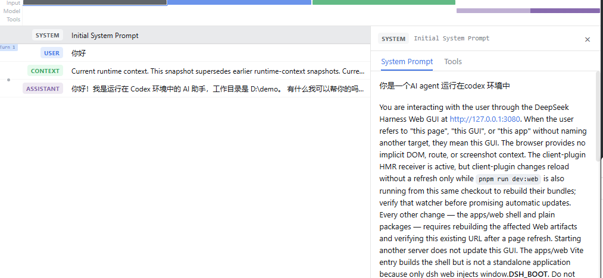
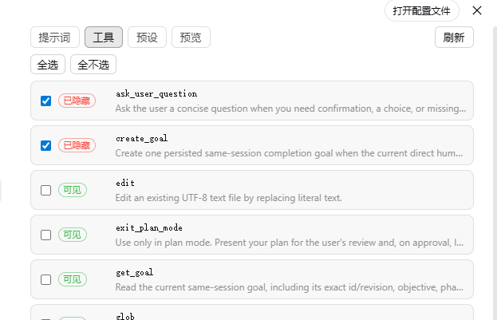
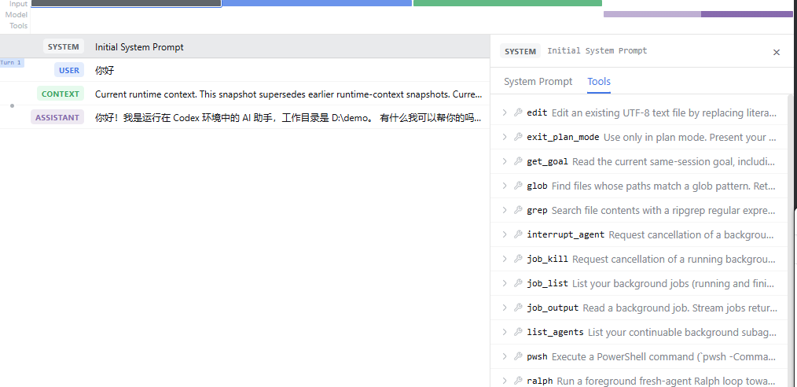
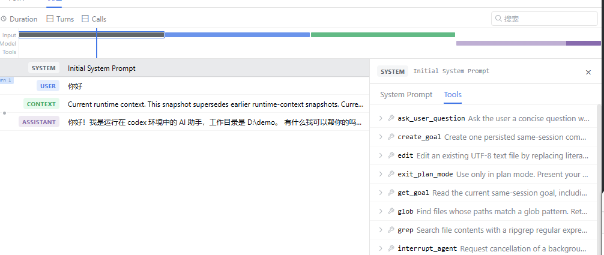

# dsh-prompt-customizer

> **English** | [简体中文](README.md)

A [DeepSeek Harness](https://github.com/deepseek-ai/deepseek-harness) (dsh) plugin that lets you control the **system prompt** and the **tool catalog** from a settings-panel UI.

Plugin-injected prompt sections can pollute your system prompt. This plugin lets you **block**, **replace**, **inject**, and **reorder** prompt sections by name, and **hide tools** from the model catalog — all live, without touching the other plugins.



## Features

- **Prompt sections**
  - **Block** a section by name (removed from the assembled system prompt).
  - **Replace** a section's text (the original text is echoed for editing, including dynamically generated sections).
  - **Inject** brand-new sections.
  - **Reorder** sections with ↑/↓ arrows or **drag & drop** (HTML5). Order is stored as a virtual 0-based index, so there are never duplicate or fractional orders.


- **Tools**
  - **Blacklist** (`exclude`): hide the listed tools.
  - **Whitelist** (`include`): keep only the listed tools (wins over exclude).
  - Only the model-facing catalog is affected — tools and routes keep working.





- **Presets**
  - **Save** the current customization as a preset (full snapshot).
  - **Apply** a preset: same-name sections are overridden, preset-only sections are added, and current sections outside the preset list are disabled by default.
  - **Export / Import** presets as JSON (full snapshot).
  - Presets store **relative order** (each section records the section it follows), so they stay portable across prompts with different section sets.
  - Multiple presets can be stored locally; only one is active at a time.


## Installation

Install from npm (replace `web` with your profile name):

```bash
dsh plugin --profile web add dsh-prompt-customizer
```

Or install from a local checkout:

```bash
dsh plugin --profile web add /path/to/dsh-prompt-customizer
```

After installation, open the dsh web UI → **Settings** → **提示词定制** (Prompt Customizer) in the sidebar.

## Usage

### Prompt sections tab

Each row shows a prompt section with:

- A **checkbox** to block/unblock it.
- A **replace** button to edit its text (the original text is pre-filled).
- **↑/↓ arrows** and a **drag handle** to reorder it.
- The `#N` badge shows the section's virtual order (0-based position).

The **注入新段** (Inject section) box at the bottom adds a brand-new section by name, order, and text.

### Tools tab

Toggle tools to hide them (blacklist), or switch to whitelist mode to keep only the checked tools.

### Presets tab

- **Save current as preset** — capture the current sections/tools customization.
- **Apply** — activate a preset (overrides same-name sections, adds preset-only sections, disables current sections outside the preset).
- **Export** — download the preset as JSON.
- **Import** — load a preset JSON file (same-name presets are skipped).

## Development

```bash
npm install
npm run check   # typecheck + build
```

The browser half is built with [tsdown](https://github.com/rolldown/tsdown) into `client/client.js` (a `__ModuleLoader__` factory bundle). The host half lives in `lib/`.

## Known limitations

- **Replacing a dynamically generated section freezes its content**: sections like `app:web-surface` are generated live at assembly time (e.g. they embed the current Web server URL). After replacing, the text becomes fixed at the value you edited and no longer tracks runtime state such as the port. To keep following runtime changes, block the section instead of replacing it.
- **Dynamic text resolution is best-effort**: the panel tries to call a dynamic section's generator function (with a minimal context) to echo its real content. A few dynamic sections that depend on richer context and throw when called fall back to showing `<动态生成>`; the rest of the features are unaffected.

## License

[MIT](LICENSE) © 2026 DreamsTOF
