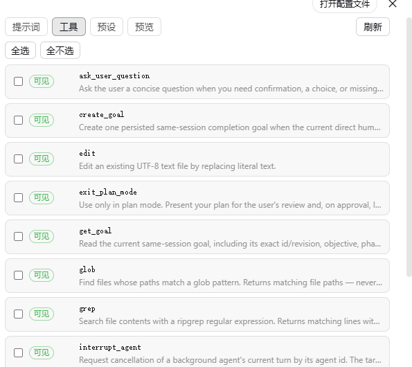

# dsh-prompt-customizer

> [English](README.en.md) | **简体中文**

一个 [DeepSeek Harness](https://github.com/deepseek-ai/deepseek-harness) (dsh) 插件，让你通过设置面板 UI 控制**系统提示词**和**工具目录**。

其他插件注入的提示词段可能会污染你的系统提示词。本插件让你可以按名称**屏蔽**、**替换**、**注入**和**排序**提示词段，并从模型目录中**隐藏工具**——全部实时生效，无需改动其他插件。


## 功能特性

- **提示词段管理**
  - **屏蔽**指定名称的段（从组装后的系统提示词中移除）
  - **替换**某段的文本（编辑时会回显原始文本，包括动态生成的段）
  - **注入**全新的段
  - 通过 **↑/↓ 箭头**或**拖拽**（HTML5）排序。顺序以虚拟的 0 起始下标存储，因此不会出现重复或小数 order



- **工具过滤**
  - 隐藏列出的工具
  - 只影响面向模型的目录，工具与路由仍正常工作


- **预设系统**
  - **保存**当前定制为预设（完整快照）
  - **应用**预设：同名段被覆盖、预设独有段被添加、预设名单之外的当前段默认被屏蔽
  - **导出 / 导入**预设为 JSON（完整快照）
  - 预设存储**相对顺序**（每段记录它跟在哪个段之后），因此可跨不同段集合的提示词移植
  - 本地可保存多个预设，同一时间只能激活一个


## 安装

从 npm 安装：

```bash
dsh plugin --profile web add dsh-prompt-customizer
```

<br />

安装后，打开 dsh Web UI → **设置** → 侧边栏中的 **提示词定制**。

## 使用说明

### 提示词 Tab

每一行代表一个提示词段，包含：

- **复选框**：屏蔽 / 取消屏蔽
- **替换**按钮：编辑该段文本（默认回显原始文本）
- **↑/↓ 箭头**和**拖拽手柄**：调整顺序
- `#N` 徽标显示该段的虚拟顺序（0 起始的位置）

底部的 **注入新段** 区域可按名称、顺序和文本添加全新段。

### 工具 Tab

勾选工具以隐藏（黑名单），或切换到白名单模式仅保留勾选的工具。

### 预设 Tab

- **保存当前为预设**：捕获当前的提示词 / 工具定制
- **应用**：激活某个预设（覆盖同名段、添加预设独有段、屏蔽预设名单之外的当前段）
- **导出**：将预设下载为 JSON
- **导入**：加载预设 JSON 文件（同名预设会被跳过）

## 开发

```bash
npm install
npm run check   # typecheck + build
```

浏览器端使用 [tsdown](https://github.com/rolldown/tsdown) 打包为 `client/client.js`（`__ModuleLoader__` factory bundle）。宿主端代码位于 `lib/`。

## 已知限制

- **替换动态生成的段会固定其生成内容**：像 `app:web-surface` 这类段在装配时实时生成（如嵌入当前 Web 服务器 URL）。替换后，文本会固定为您编辑时的值，不再随端口等运行时状态自动更新；如需跟随运行时变化，请勿替换该段，改用屏蔽。
- **动态文本解析是尽力而为**：面板读取动态段时会尝试调用其生成函数并传入最小上下文，以便回显真实内容。个别依赖更复杂上下文、调用时会抛错的动态段会回退显示 `<动态生成>`，不影响其余功能。

## License

[MIT](LICENSE) © 2026 DreamsTOF
