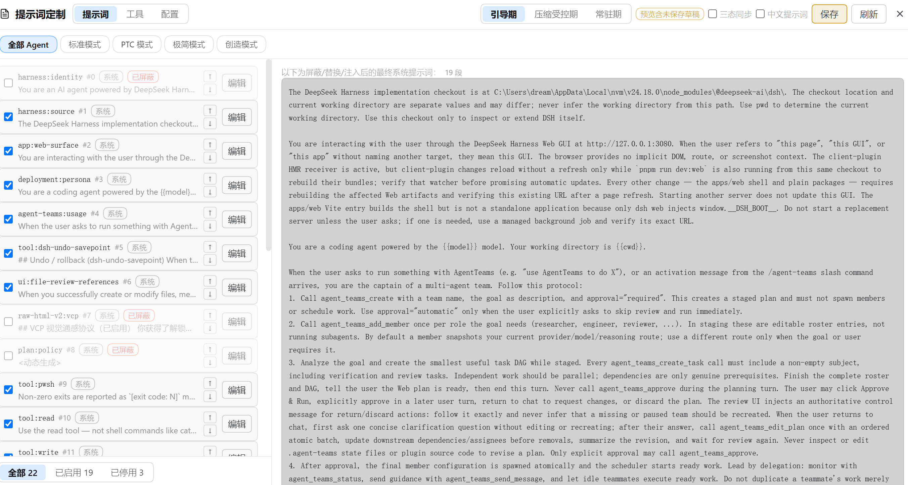
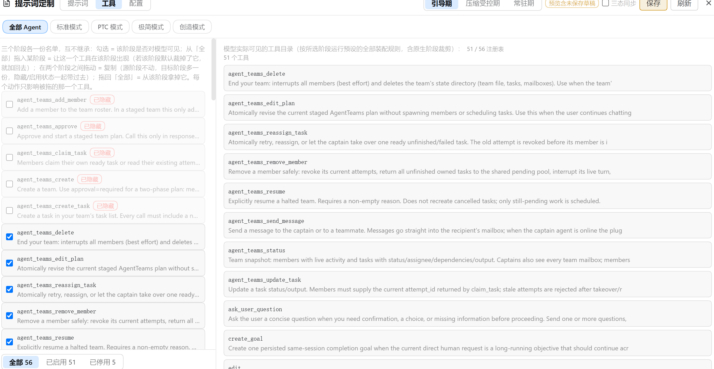

<p align="center">
  
</p>

<h1 align="center">dsh-prompt-customizer</h1>

<p align="center">
  <strong>DeepSeek Harness 的系统提示词与工具目录定制器。<br>
  按名称屏蔽 / 替换 / 注入 / 排序提示词段，按会话阶段与 agent 预设分层 —— 全部在侧边栏的独立「提示词管理」面板里完成。</strong>
</p>

<p align="center">
  <a href="README.en.md">English</a> ·
  <strong>简体中文</strong>
</p>

<p align="center">
  <a href="#安装">安装</a> •
  <a href="#功能特性">功能特性</a> •
  <a href="#使用说明">使用说明</a> •
  <a href="#工作原理">工作原理</a> •
  <a href="#已知限制">已知限制</a>
</p>

<p align="center">
  <a href="https://github.com/DreamsTOF/dsh-prompt-customizer/releases"></a>
  <a href="https://github.com/DreamsTOF/dsh-prompt-customizer/blob/main/LICENSE"></a>
  <a href="https://github.com/deepseek-ai/deepseek-harness"></a>
  <a href="https://www.npmjs.com/package/dsh-prompt-customizer"></a>
  <a href="https://www.npmjs.com/package/dsh-prompt-customizer"></a>
  <a href="https://github.com/DreamsTOF/dsh-prompt-customizer/stargazers"></a>
</p>

<p align="center">
  <b>⭐ GitHub 仓库：<a href="https://github.com/DreamsTOF/dsh-prompt-customizer">DreamsTOF/dsh-prompt-customizer</a></b> —— 觉得有用就点个 Star；问题与需求请提 <a href="https://github.com/DreamsTOF/dsh-prompt-customizer/issues">Issue</a>
</p>

<p align="center">
  
</p>

---

一个 [DeepSeek Harness](https://github.com/deepseek-ai/deepseek-harness) (dsh) 插件，让你在侧边栏的独立面板里控制**系统提示词**和**工具目录**（仿宿主能力管理页：顶部 agent 预设 Tab、左栏勾选列表 + 底部三态过滤、右栏实时预览）。

其他插件注入的提示词段可能污染你的系统提示词。本插件让你按名称**屏蔽**、**替换**、**注入**、**排序**提示词段，并把工具从**模型可见目录**里隐藏 —— 全程实时生效，不需要改动任何其他插件。

两件事贯穿整个设计：

- **按会话阶段分层**：引导期（未晋级）/ 常驻期（晋级后）/ 压缩受控期（压缩后仍未晋级）各有**独立的屏蔽名单、独立的排序空间、独立的工具目录**。同一个预设可以做到首轮只给模型 1 个工具和几段提示词，晋级后放开全套。
- **按 agent 预设分层**：顶部预设 Tab 选「全部 Agent」改的是默认值；选中某个 agent 预设后，改动只对该预设生效（字段级覆盖，未设置的字段继续回落全局）。

## 会话阶段怎么流转

阶段不是固定三拍，而是由**持久会话事件**推导出来的：首个 durable 的 `tool/call` 或
`assistant/message` 触发晋级，一次 `compaction/end` 把晋级复位。面板上三个阶段部分
就分别对应这三种状态。

<table>
  <tr align="center">
    <td width="28%"><b>① 会话开始</b><br><code>bootstrap</code><br><b>引导期</b></td>
    <td width="6%">→</td>
    <td width="28%"><b>② 首个 durable 信号</b><br><code>tool/call</code> · <code>assistant/message</code><br><b>常驻期</b> <code>active</code></td>
    <td width="6%">→</td>
    <td width="32%"><b>③ 一次压缩</b><br><code>compaction/end</code><br><b>压缩受控期</b> <code>compaction</code></td>
  </tr>
  <tr>
    <td colspan="5" align="center">
      ④ 压缩后再来一个 durable 信号 → <b>回到常驻期</b>；只要再来一次压缩，又会落回压缩受控期
    </td>
  </tr>
</table>

完整的转移关系（引导期也能不经常驻期直接进压缩受控期）：

| 当前阶段   | 事件                                           | 去向           |
| ---------- | ---------------------------------------------- | -------------- |
| 引导期     | 首个 durable `tool/call` / `assistant/message` | **常驻期**     |
| 引导期     | `compaction/end`                               | **压缩受控期** |
| 常驻期     | `compaction/end`（晋级复位）                   | **压缩受控期** |
| 压缩受控期 | 压缩之后新的 durable 信号                      | **常驻期**     |
| 任意       | 子代理会话（`delegationDepth > 0`）            | 恒为**常驻期** |
| 任意       | 无会话的读取（清单、预览）                     | 恒为**常驻期** |

每个阶段各解析出什么 —— 面板的三个部分与配置字段一一对应：

| 面板里的部分              | 生效的段屏蔽         | 注入段的 `phase`           | 生效的工具黑名单                                           |
| ------------------------- | -------------------- | -------------------------- | ---------------------------------------------------------- |
| 引导期提示词 / 引导期工具 | `sectionsBootstrap`  | `bootstrap`（+ `always`）  | `tools.bootstrap.exclude`，未配置则回落静态                |
| 常驻期提示词 / 常驻期工具 | `sections`           | `active`（+ `always`）     | `tools.exclude`（静态）                                    |
| 压缩受控期提示词 / 工具   | `sectionsCompaction` | `compaction`（+ `always`） | `tools.compaction.exclude`，未配置则回落引导期，再回落静态 |

两点容易踩：

- **`always` 注入段三个阶段都在**，且各阶段的排序空间独立 —— 所以本插件产出的阶段条目排在 `always` 组之后（运行时按数组序后写覆盖前写，阶段序才压得住全局序）。
- **阶段视图是"这个状态会解析成什么"，不是"会话曾经是什么"**。预设原生的阶段规则（zero-tool bootstrap、warmup 等）在同一时刻也在生效，并且可能在其它插件之后改动结果 —— 见[已知限制](#已知限制)。

## 界面

两张图覆盖全部功能 —— 侧边栏点 **提示词定制** 打开独立面板，头部是模式切换（提示词 / 工具 / 配置）+ 阶段 Tab（引导期 / 压缩受控期 / 常驻期，左右两栏联动）+ 三态同步与中文提示词开关；第二行是 agent 预设 Tab（「全部 Agent」+ 各预设）。

**提示词模式**：左栏当前阶段的勾选列表（屏蔽 / 替换 / 注入 / 排序，底部三态过滤），右栏实时预览装配后的最终系统提示词：



**工具模式**：左栏该阶段的工具目录勾选列表，「本系统全部工具」池可把注册表里仍有的工具加回该阶段；右栏是模型可见目录（含「模型可见 / 注册表总数」对照）：



## 功能特性

### 提示词段

- **屏蔽**：按名称从装配结果里移除该段。被屏蔽的行不会消失，仍可编辑、恢复 —— 屏蔽只意味着不注入模型。
- **替换**：编辑该段文本，编辑框预填当前生效文本（动态段会尽力解析出真实内容再回显）。
- **注入**：每个阶段里「+ 注入」展开表单，按名称 + 文本新建一段，带 `手动` 徽标，随时可删除。
- **排序**：行内 ↑/↓ 箭头。顺序以 0 起始的连续虚拟下标存储，不会出现重复或小数 order，也不需要手填数字。
- **每阶段独立**：引导期屏蔽写 `sectionsBootstrap`，压缩受控期写 `sectionsCompaction`，常驻期写 `sections`；三份名单互不继承、互不影响，排序空间也互不干扰，因此「引导期只留 5 段、常驻期全开」可以分别表达 —— 在一个阶段屏蔽 / 恢复某段，绝不会改变它在其它阶段的状态。从「本系统全部提示词」池把段**加入**当前阶段即成为当前阶段的独立副本（带原文写入本阶段注入条目）。
- **强制覆盖（`forceSections`，默认开）**：包装宿主的装配入口，最终提示词段直接从注册表原始段重建 —— 预设插件自身的阶段裁段（如 liangshen 引导期 20→1）与 persona 的 `complete: true` 整段接管都无法再改写本插件的屏蔽 / 替换 / 注入 / 排序结果；工具目录与动态上下文保持预设与宿主行为。设为 `false` 退回瀑布流内过滤（此时完整段接管仍会压制段级定制）。
- **中文提示词开关（面板头部工具栏，刷新按钮旁）**：开启 = 把名字对得上内置译本（`lib/zh/`，全池 25 段中可静态翻译的 24 段）的段一次性覆盖为中文；关闭 = 清掉这些段的替换文本，回归英文原文。两个方向都写入编辑草稿，与手动编辑同一条保存路径；开关状态从配置探测，不新增字段。自定义段与对不上名字的段不受影响，段数与注入不增不减。`{{...}}` 提示词变量（如 persona 的 `{{model}}` / `{{cwd}}`）、机器路径与代码块逐字保留；`tools:sdk` 只替换前导散文，TS 代码块取自原文。
- **三态同步（头部开关，默认关）**：开启后提示词 / 工具两栏的屏蔽与解除屏蔽（含工具加回）对三个阶段一起生效，只作用于同名的那一项 —— 想让一段提示词 / 一个工具在三个阶段同时开或关时不用点三遍。

### 工具目录

- **勾选 = 该阶段对模型可见**（`exclude`）：取消勾选即在**该阶段**隐藏这个工具，勾回来就恢复，被隐藏的行半透明原位保留。没有白名单模式 —— 它会让 `exclude` 整体失效，一次勾选就能悄悄关掉该阶段其它所有工具，而表达能力并不比反选更多。
- **「加回」名单（`add`）**：被该阶段裁掉、但**注册表里仍有**的工具，可从「本系统全部工具」池加入该阶段 —— 装配时在过滤**之后**从注册表查回 schema 追加（`exclude` 优先：同一名字两边都在 = 隐藏）。注册表里根本没有的工具（别的预设独有）加不进来，界面会明确说明。
- **阶段目录**：引导期与压缩受控期各有独立的 exclude / add 名单，运行时优先级为 **压缩受控期 > 引导期 > 静态** —— 压缩后仍未晋级且配了压缩目录就用它，否则未晋级时用引导目录，其余情况用静态过滤。
- **扩充的天花板是注册表**：只能把注册表里已有的工具加回某个阶段；要让一个全新工具出现，得改预设的组成，不是这里。
- 只影响面向模型的目录；工具本身与路由照常工作。

### 模型视角预览

预览常驻面板右栏：提示词模式看最终系统提示词，工具模式看模型可见目录（右栏可切提示词 / 工具子视图），随头部阶段 Tab 联动切换。它展示经过**所有插件**过滤后的最终装配结果，所见即模型所见。工具视图给出「模型可见 / 注册表总数」的对照 —— PTC、Code Mode 这类预设会把整套目录包装成单个 `run_code`，只看注册表会误判。

### 提示词变量

宿主只注册 `provider` / `model` / `cwd` 三个变量，段文本里引用别的 `{{name}}` 会直接让整次装配失败。本插件经官方扩展点追加两类变量：

- **内置系统事实**：`date` / `time` / `datetime` / `weekday` / `hostname` / `platform` / `arch` / `username` / `home` / `shell` / `locale` / `node_version`，每次装配现算。
- **全量环境变量**：`process.env` 的每个键映射为 `env_<小写，非法字符归并为 _>`，如 `PATH` → `{{env_path}}`、`USER.NAME` → `{{env_user_name}}`。

**黑名单（`envBlocklist`）**：env 里常有密钥，进了提示词就会随请求发给模型，所以命中黑名单的键不注册。预填条目覆盖常见凭据类键（含 `SECRET` / `TOKEN` / `PASSWORD` / `API_KEY` / `*_DSN` 等），条目支持 `*` 通配、大小写不敏感；面板的环境变量黑名单卡片可随时增删，卡里的折叠列表给出当前实际注册的变量清单。黑名单变化在下次装配生效（面板改动或直接改 `config.yaml` 都一样）。

**导出 / 导入随行**：导出预设时当前黑名单随行写入文件；导入端按并集并入（只增不减），与快照库语义一致。

严格渲染的代价：段里引用了一个未注册的名字（如被黑名单挡下的键），**整段装配失败**而不是留空 —— 面板清单里没列出的名字不要用。

### 配置快照与 agent 预设

- **保存当前配置**：把当前作用域的完整定制（含每阶段屏蔽名单、每阶段排序、阶段工具目录）存成一份可复用的配置快照。
- **应用**：同名段被覆盖、快照名单之外的当前段被默认屏蔽；快照里当前系统匹配不上的段默认跳过（跨系统导入不凭空建段），快照里没有的阶段字段保留你当前的值，不会被抹掉。同一时间只有一份在用。
- **导出 / 导入**：配置快照以 JSON 往返（Tauri 桌面走原生对话框，Web 走下载 / 文件选择），同名预设会被跳过。顺序以相对形式存储（每段记住它跟随谁），快照因此可跨不同段集合移植。
- **存为 agent 预设**：整体**复制**当前编辑目标的预设目录（组成文件、伴生脚本、技能目录一并带走）到用户预设根，再把当前定制写进它的覆盖项。新预设随即出现在头部预设 Tab 里 —— 它是一个真正可切换的 agent 预设，而不只是一份配置副本。

### 跨预设的注册表池

「本系统全部提示词 / 本系统全部工具」不随编辑目标切换：它是一个**跨预设、只增不减的并集**（同名后见到者赢，新名追加），随你浏览各预设逐步长齐，存放在 `catalog.yaml` 这个派生缓存里，删掉会自行重建。

## 工作原理

一次改动从面板到模型的完整链路：

<table>
  <tr align="center">
    <td width="19%"><b>① 侧边栏面板</b><br>左栏勾选列表 / 右栏预览<br><i>只改内存草稿</i></td>
    <td width="3%">→</td>
    <td width="19%"><b>② 插件自有路由</b><br><code>/config</code> · <code>/config/apply</code><br><code>/preview</code> · <code>/inventory</code> · <code>/presets</code></td>
    <td width="3%">→</td>
    <td width="19%"><b>③ config.yaml</b><br>全局字段 + <code>overrides[预设]</code><br><i>mtime 懒加载，手改即时生效</i></td>
    <td width="3%">→</td>
    <td width="34%"><b>④ 装配瀑布流</b><br><code>system-prompt/assemble</code> 钩子按会话推导阶段，<br>解析出生效配置并过滤</td>
  </tr>
  <tr>
    <td colspan="9" align="center"><b>④ 内部依次是</b>：<code>mergeConfig(全局, overrides[会话所属预设])</code> → 段：屏蔽 → 替换 → 注入 → 按 order 排序；工具：<code>pickToolsFilter</code>（压缩 &gt; 引导 &gt; 静态）→ <code>applyToolFilter</code></td>
  </tr>
  <tr>
    <td colspan="9" align="center">
      <b>⑤ 交卷前还有一手</b>：宿主在瀑布流<b>之后</b>，若存在 <code>complete: true</code> 的段就把整份 sections 还原成那一条 —— 这就是面板会对这类预设亮黄标的原因（工具目录不受影响；<code>forceSections</code> 开启时本插件已在装配入口重建 sections，接管被绕过，不再亮黄标）
    </td>
  </tr>
  <tr>
    <td colspan="9" align="center"><b>⑥ 模型收到</b>：最终系统提示词 + 可见工具目录；右栏预览读的就是这一份结果</td>
  </tr>
</table>

代码地图：

| 路径                              | 作用                                                                             |
| --------------------------------- | -------------------------------------------------------------------------------- |
| `lib/index.js`                    | 宿主端：装配钩子、五条 HTTP 路由、agent 预设 fork、遗留字段一次性清理            |
| `lib/effective.js`                | 纯函数：字段级 override 合并、阶段选取（注入段 / 工具目录）、黑名单过滤          |
| `lib/promotion.js`                | 由 durable 事件推导 `{promoted, boundary}`，压缩复位、子代理恒已晋级             |
| `lib/vars.js`                     | 提示词变量：内置系统事实 + env 全量映射 / 黑名单，装配入口按签名懒同步           |
| `lib/sectionOps.mjs`              | **面板与单测共用**的阶段状态纯函数（名单写回目标、注入身份、重排、逐阶段持久化） |
| `lib/store.js` / `lib/catalog.js` | 原子写 + last-good 回落的配置存储；跨预设段/工具累积登记表                       |
| `src/client/`                     | 面板（React，无 JSX 语法糖依赖，`h()` 直写），构建进 `client/client.js`          |

关键约定：阶段逻辑只有一份实现 —— `lib/sectionOps.mjs` 既被 tsdown 打进浏览器包，也被
`node --test` 直接 import 跑单测，所以「测试通过」和「界面行为」之间不存在第二套代码。

## 安装

```bash
dsh plugin --profile web add dsh-prompt-customizer
```

也可从本地检出安装：

```bash
dsh plugin --profile web add /path/to/dsh-prompt-customizer
```

安装后打开 dsh Web UI，侧边栏浏览区上方就是 **提示词** 入口（点击打开覆盖主区的「提示词管理」面板）。

## 使用说明

侧边栏浏览区上方点 **提示词定制**，打开覆盖主区的独立面板。头部：模式切换（提示词 / 工具 / 配置）、阶段 Tab（引导期 / 压缩受控期 / 常驻期 —— 左栏列表与右栏预览联动切换同一个阶段）、三态同步与中文提示词开关、保存 / 刷新 / 关闭；第二行是 agent 预设 Tab：「全部 Agent」改的是默认值，选中某个预设后改动只对该预设生效。

### 提示词模式

左栏列出当前阶段的段：

- **勾选框**：该阶段是否注入模型（`未屏蔽` / `已屏蔽` 徽标）；被停用的行半透明原位保留，随时勾回
- **编辑**：按阶段替换该段文本，替换过的行带 `已替换` 徽标与「还原」按钮
- **↑/↓**：调整该阶段内的顺序；`#N` 是它当前的虚拟下标
- `系统` / `手动` 徽标标明段的来源，只有 `手动` 段可以删除
- **「+ 注入」**：展开表单按名称 + 文本新建一段（阶段锁定为当前 Tab）
- **底部三态过滤**：全部 / 已启用 / 已停用，只统计当前阶段

「本系统全部提示词」只读池收在列表末尾的折叠区，每行三个小按钮把该段加入对应阶段。右栏实时预览当前阶段装配后的最终系统提示词 —— 编辑草稿的效果同步呈现，面板会标注「预览尚未保存草稿」。

### 工具模式

左栏列出该阶段进入过滤的目录 ∪ 你加回的工具：勾选 = 该阶段对模型可见，取消 = 在该阶段隐藏。「本系统全部工具」池收在折叠区，每行三个小按钮把该工具加入对应阶段。想看模型真正拿到几个工具，看右栏预览的「模型可见 / 注册表总数」对照。

### 配置模式

左栏是**配置快照库**（保存当前配置 / 导入 / 应用 / 导出 / 删除，正在使用的那份带「使用中」标记）；右栏是**存为 agent 预设**（整体 fork 当前编辑目标的预设目录并写入当前定制）与**全局设置**：强制覆盖开关、环境变量黑名单（增删条目、查看当前实际注册的变量清单）、提示词变量参考、恢复初始状态（清空全部定制并关闭 `forceSections`，与卸载插件等效，无需重启，点击需二次确认）。

### 编辑目标与保存

预设 Tab 决定改动落在哪。提示词与工具模式共享同一份未保存草稿，**保存**按钮一次落盘；切到配置模式或切换编辑目标会丢弃草稿（脏草稿先弹确认）。也就是说：写坏的东西不点保存就不会进文件。

## 配置存放位置

- `~/.dsh/prompt-customizer/config.yaml` —— 唯一权威配置。首次启动时若该文件不存在而旧版 `settings.yaml` 里有对应段落，会自动迁移一次（主文档原样保留，可回滚）。手工编辑即时生效，无需重启。
- `~/.dsh/prompt-customizer/catalog.yaml` —— 跨预设的段 / 工具累积登记表，纯派生缓存，删掉会随浏览重建。

## 已知限制

下面都是实测结论。面板在相关情况下会直接给出黄色警示，不需要你猜：

- **有些预设的提示词不由段组成。** 若某个段以 `complete: true` 注册（dsh-persona 的「整段接管」），宿主会在装配瀑布流**之后**把整份 sections 还原成那一条段。`forceSections`（默认开）已在装配入口绕开该机制，段级定制照常生效；只有把它设为 `false` 时，本插件的屏蔽 / 替换 / 注入 / 排序才会对这类预设无效（工具过滤不受影响），面板会写明「最终系统提示词由 `deployment:persona` 段整段接管」。
- **丢弃段的原因不止一种**。除了 `complete` 接管，也存在预设用自己的规则在特定阶段裁段（实测某预设引导期 20 段 → 1 段，而注册表里并没有 complete 段）。所以面板还做了一次机制无关的比对：把本插件产出的段名与最终装配逐名核对，不符时提示「产出 N 段，模型只见 M 段」。
- **预览的伪会话可能降级**。阶段视图由一次合成会话驱动，个别预设插件会在这种会话上抛错；此时该阶段回退为无会话装配并标注「已降级」，即那个阶段看到的是不带原生阶段裁剪的结果。
- **替换动态生成的段会固定其内容**。像 `app:web-surface` 这类段在装配时实时生成（嵌入当前 Web 端口等）。替换后文本冻结为你编辑时的值，不再跟随运行时变化；想保持跟随请改用屏蔽。
- **动态段文本解析是尽力而为**。面板读取动态段时会尝试调用其生成函数（只传最小上下文）来回显真实内容；依赖更复杂上下文、一调就抛的段会显示 `<动态生成>`，其余功能不受影响。另外，带 `{{model}}` / `{{cwd}}` 之类变量的段在列表里显示的是**未替换的模板**，右栏预览里才是替换后的最终文本。
- **导出依赖宿主允许下载**。Web 回退走浏览器下载：若宿主 webview 静默丢弃下载，面板仍会提示「导出成功」而文件没有落地。导入（文件选择）不受影响。
- **工具目录的扩充以注册表为天花板**，见前文「扩充的天花板是注册表」。

## 开发

```bash
npm install
npm run check   # typecheck + build + 全量单测
```

浏览器端用 [tsdown](https://github.com/rolldown/tsdown) 打包成 `client/client.js`（`__ModuleLoader__` factory bundle），宿主端代码在 `lib/`。阶段状态逻辑集中在 `lib/sectionOps.mjs`：同一份纯函数既被 UI 打包使用，也被 `node --test` 直接覆盖，测试即上线代码。

## License

[MIT](LICENSE) © 2026 DreamsTOF

---

## Star History

[](https://star-history.com/#DreamsTOF/dsh-prompt-customizer&Date)

---

<p align="center">
  <strong>⭐ 如果这个插件让你的系统提示词更干净、工具目录更听话，就给它一个 star 吧！</strong>
</p>
